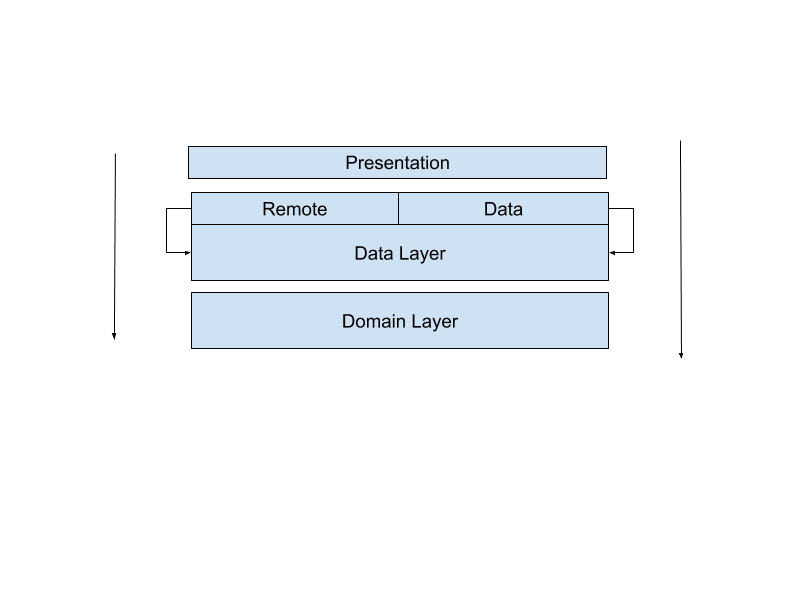

# Avion
Android app that gets a list of airline schedules and display their origin and destination airports on a map,
it uses uncle bob's clean architecture

|                                              |                                              |                                             |
|:---------------------------------------------|:---------------------------------------------|:--------------------------------------------|
|  |  |  |
|              |   |  |

## Set up
Inside the app-level build.gradle file, replace **CLIENT_ID** and **CLIENT_SECRET** with the values
gotten from Lufthansa [Website](https://developer.lufthansa.com/​)
Also move to the values folder, in presentation module, search for google_maps_api.xml and insert your **GOOGLE_API_KEY**

## Architecture
This App is built with [uncle bob's clean architecture approach](https://blog.cleancoder.com/uncle-bob/2012/08/13/the-clean-architecture.html) the app is broken down into
different modules namely:
- **Domain**: This is the inner most layer of the app, it contains the business logic to the most basic thing the user can do, etc login into the app, this layer doesn't know about any other thing in the app, this abstraction made it easier for me to test the business logic in isolation.
- **Data**: This handles data related operations such as fetching, caching and basic data management, i further broke down this layer into:
  - **Remote**: Handles network related data operation, such as fetching data from [Lufthansa API](https://developer.lufthansa.com/​)
  - **Cache**: Handles saving data using shared preferences and database

- **Presentation**: This contains the UI part of the App, which itself used the MVVM pattern to decople the view(activities and fragments) from the data processing class(in my case a View Model)
- The communication between the view and the viewModel is done using LiveData(a really advanced usecase of the observer design pattern, it was built specifically for android)

### Presentation Layer
Screens that work together are grouped into the same activity and they share the viewModel tired to that activity, individual screens are placed in fragments, by doing it this way,
it became easier for me to sync data in all screens when any operation happens in any of the screens(by the help is subscribing to the data stream it is interested in --in my case to a specific live data)

Navigating between screens is done by using **jetpack navigation component**

### Architecture diagrams

#### Overall Architecture

#### Data Module Architecture

#### Domain Module Architecture

## Challenges and Approach
In the process of developing this app, some challenges i encountered are:
1. Where to get airport data, to get the flight schedules, **Lufthansa API** requires me to enter an airport code, i found out that there where no API for that, but thanks to [This repo](https://github.com/jbrooksuk/JSON-Airports)
    I was able to download a really huge json list of airports all over the world.
2. Another problem arises which was how do i make searching through that huge list to be fast as possible, i decided to store the whole list in a db, then index some field that the user is likely to search for, after doing this, the speed of search was greatly improved from O(n) to log(n).
3. How do i move data from one layer to another? to over come this, i used data mappers to convert an object to a specific type in another layer.

## Frameworks
**Dagger 2** For dependency injection
**RxJava** for Asynchronous task
**Mockito** for Mocking and assertions
**Room** easy data persistence
**Retrofit** for API calls
**Gson** for Json parsing

